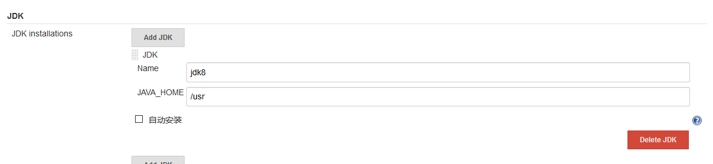
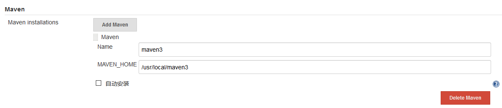

## 全局工具配置

- **JDK**
```
[root@jenkins ~]# which  java
/usr/bin/java
```


- **MAVEN**
```
[root@jenkins ~]# which  mvn
/usr/local/maven3/bin/mvn
```


- **Git**
```
[root@jenkins ~]# yum install -y git
```

> Note： The paths of all machines need to be consistent
 