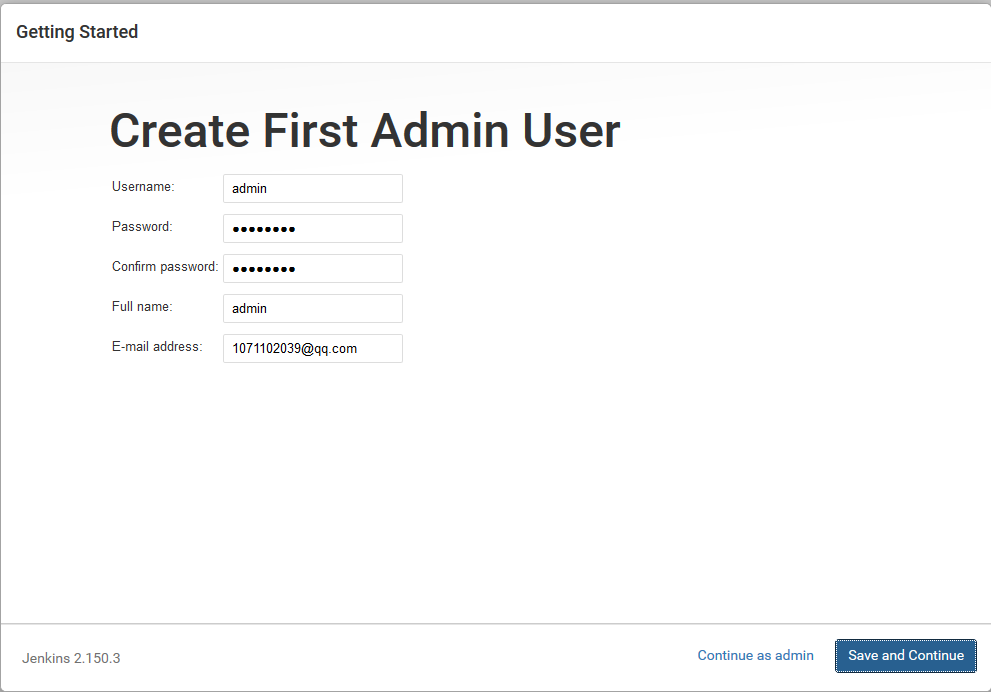

## Prerequisites
Minimum hardware requirements:
- 256 MB of RAM
- 1 GB of drive space (although 10 GB is a recommended minimum if running Jenkins as a Docker container)

Recommended hardware configuration for a small team:
- 1 GB+ of RAM 
- 50 GB+ of drive spac

Sofware requirements:
-  Java 8 - either a Java Runtime Environment (JRE) or a Java Development Kit (JDK) is fine 
> Note:This is not a requirement if running Jenkins as a Docker container.


## Installation Jenkins

#### platforms

```
[root@jenkins ~]# cat /etc/redhat-release 
CentOS Linux release 7.6.1810 (Core)
```

#### jdk
```
[root@jenkins ~]# rpm -ivh jdk-8u25-linux-x64.rpm
[root@jenkins ~]# which  java
/usr/bin/java
[root@jenkins ~]# java -version
java version "1.8.0_25"
Java(TM) SE Runtime Environment (build 1.8.0_25-b17)
Java HotSpot(TM) 64-Bit Server VM (build 25.25-b02, mixed mode)
```

#### jenkins
```
[root@jenkins ~]# wget -O /etc/yum.repos.d/jenkins.repo https://pkg.jenkins.io/redhat-stable/jenkins.repo
[root@jenkins ~]# rpm --import https://pkg.jenkins.io/redhat-stable/jenkins.io.key
[root@jenkins ~]# yum install -y jenkins
```

#### start
```
[root@jenkins ~]# systemctl  stop firewalld
[root@jenkins ~]# systemctl  disable firewalld
[root@jenkins ~]# setenforce  0
[root@jenkins ~]# /etc/init.d/jenkins  start
```
## Post-installation setup wizard

#### Unlocking Jenkins
```
[root@jenkins ~]# cat /var/lib/jenkins/secrets/initialAdminPassword
baf45e805cf04e76a39cc06a8dc90cc3
```

#### Customizing Jenkins with plugins

- Install suggested plugins.

> Installation of Jenkins Can't Connect to Install Plug-ins to Solve the Problem:
> - Replace file contents：`sed -i 's@https://updates.jenkins.io/update-center.json@http://updates.jenkins.io/update-center.json@g'  /var/lib/jenkins/hudson.model.UpdateCenter.xml` 
> - Open a new browser label input: `http://localhost:8080/exit`
> - Restart Jenkins: `/etc/init.d/jenkins restart`

#### Create First Admin User




- [官方文档](https://pkg.jenkins.io/redhat-stable/)
- [wiki](https://wiki.jenkins.io/display/JENKINS/Installing+Jenkins+on+Red+Hat+distributions)
