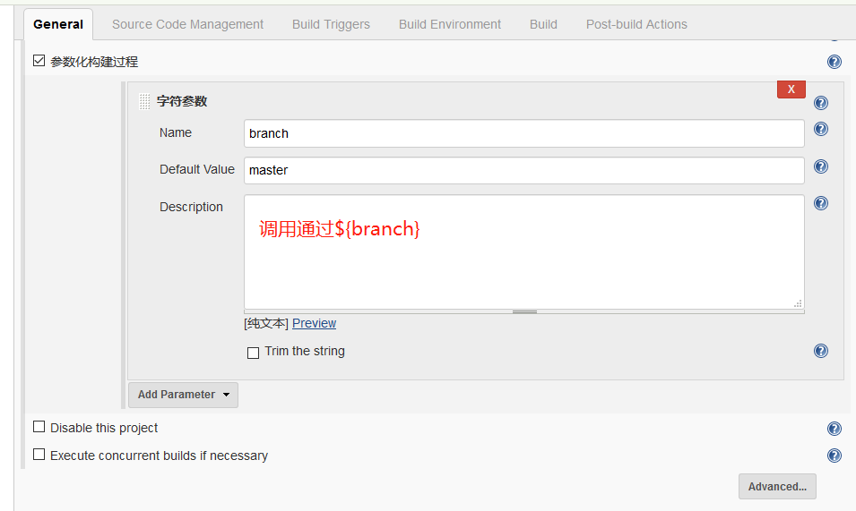
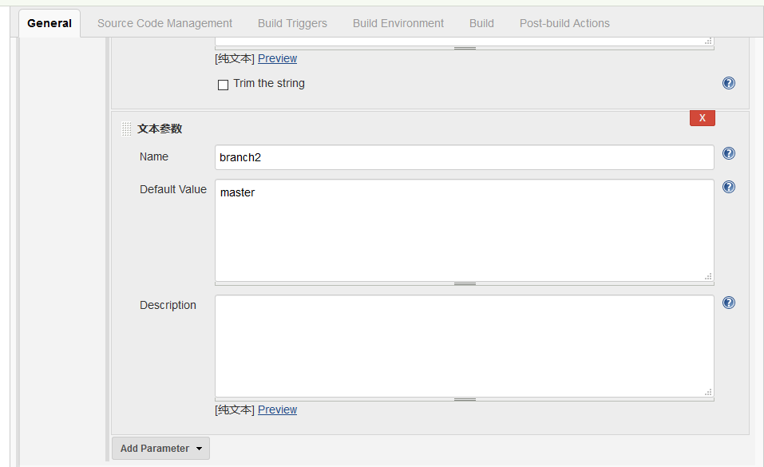
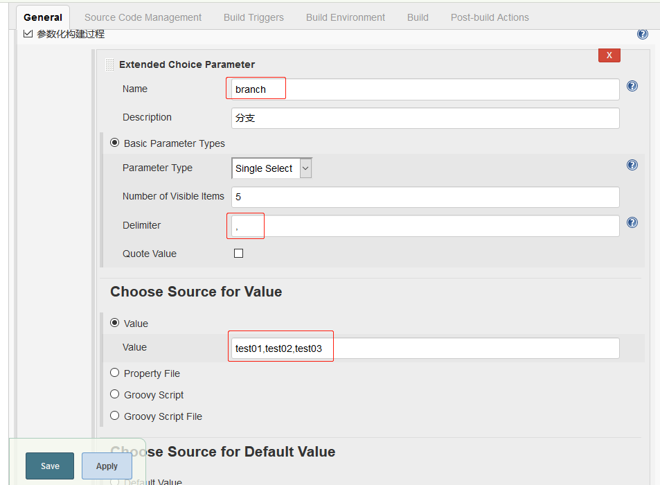
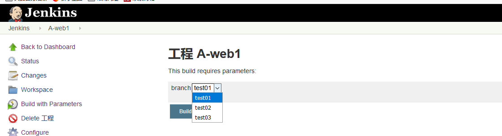
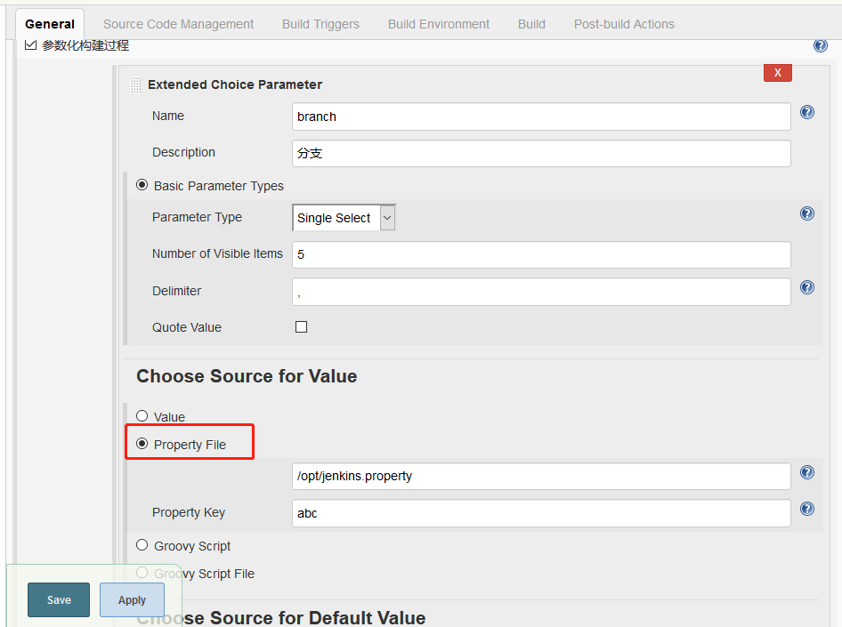
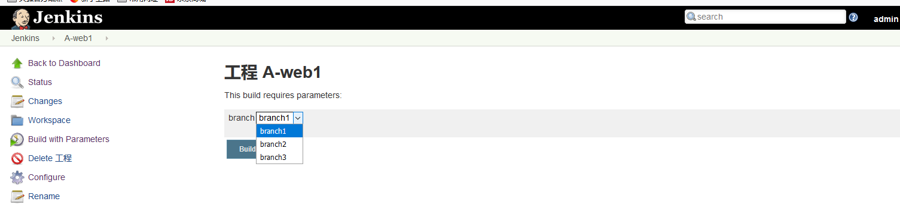
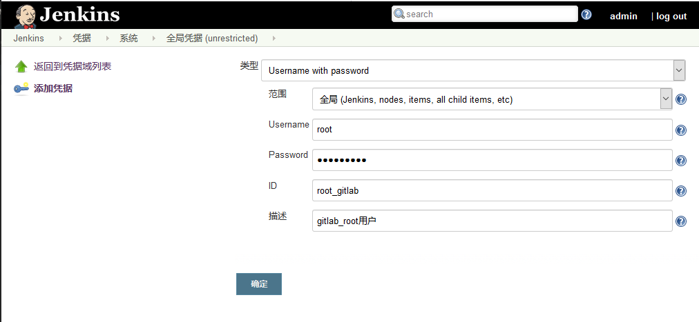
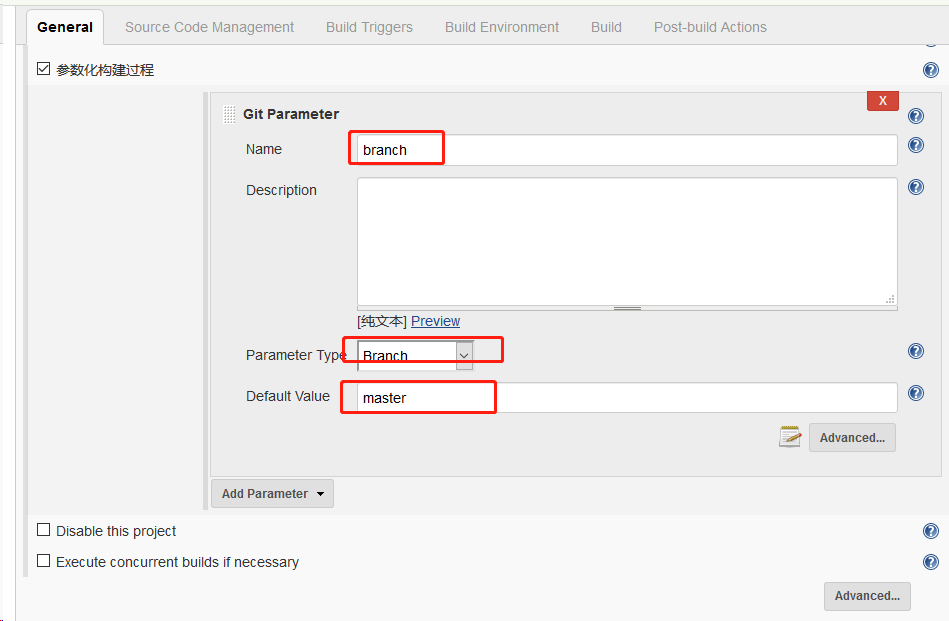
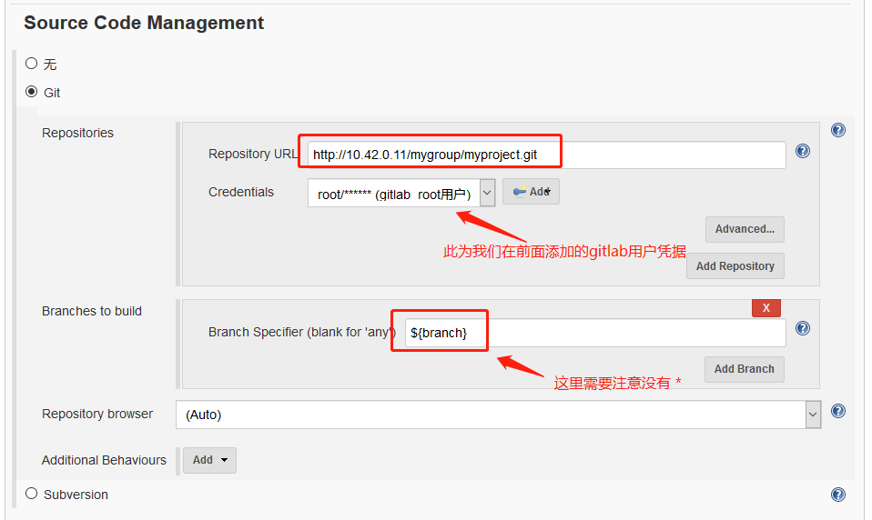
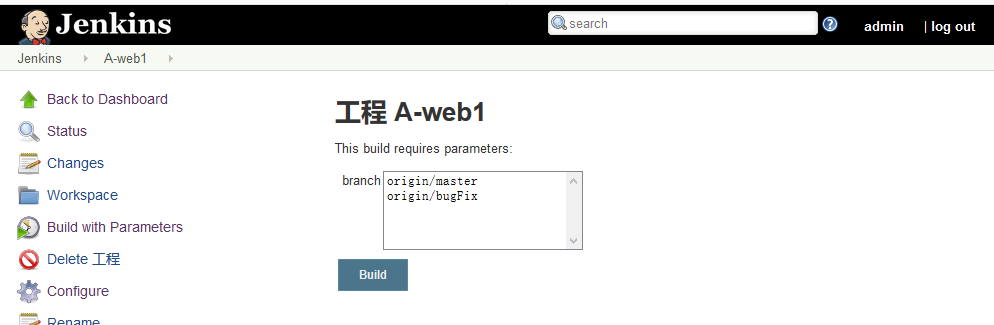

## Necessary plug-ins

### 默认的参数化构建

-  字符参数



- 文本参数



### Extended Choice Parameter-`requires manual installation`



-------------------------------------------------------------------------------






### Git Parameter-`requires manual installation`

- **1、Add Global User 凭据**



> 说明这里添加 `gitlab` 账号的用户名和密码,不是`gitlab`服务器的用户名和密码

- **2、Jenkins 使用root 用户运行** 

```
sed -i 's@JENKINS_USER="jenkins"@JENKINS_USER="root"@g /etc/sysconfig/jenkins && /etc/init.d/jenkins restart 
```
- **3、参数化构建过程**





