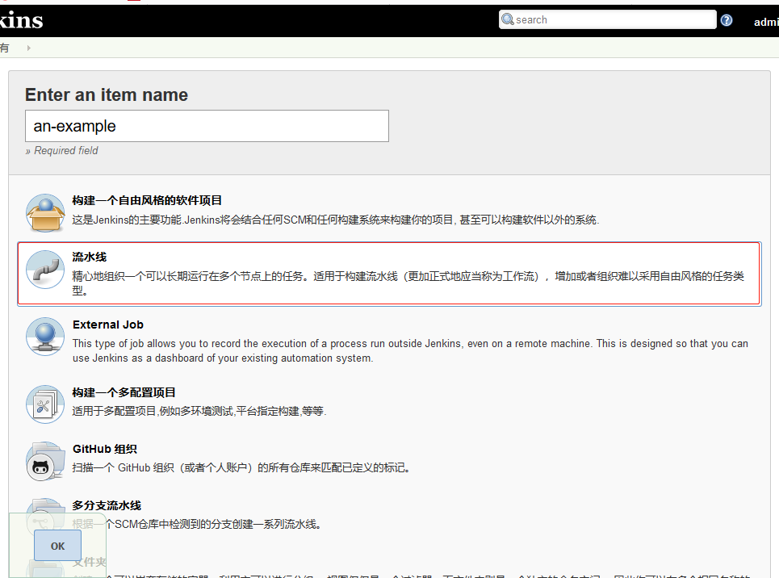
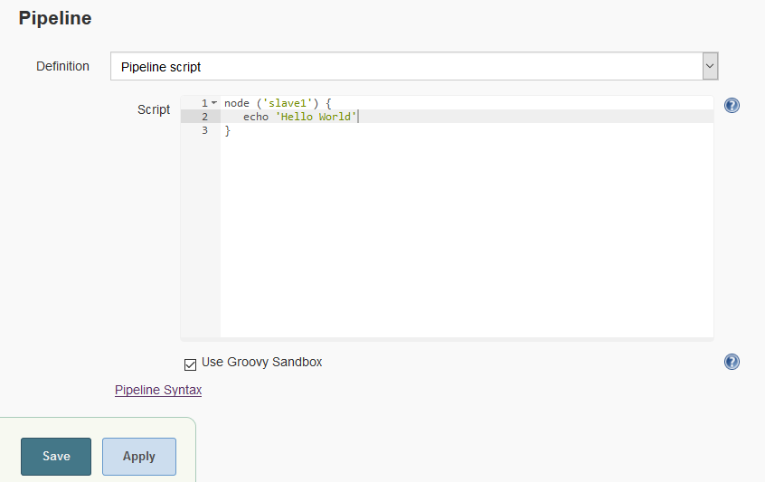
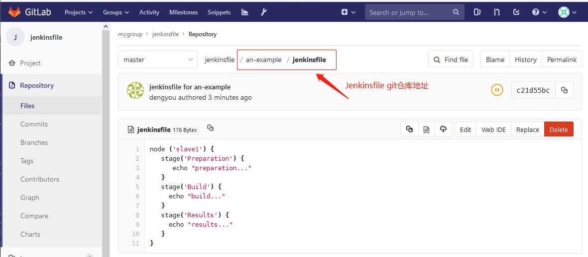
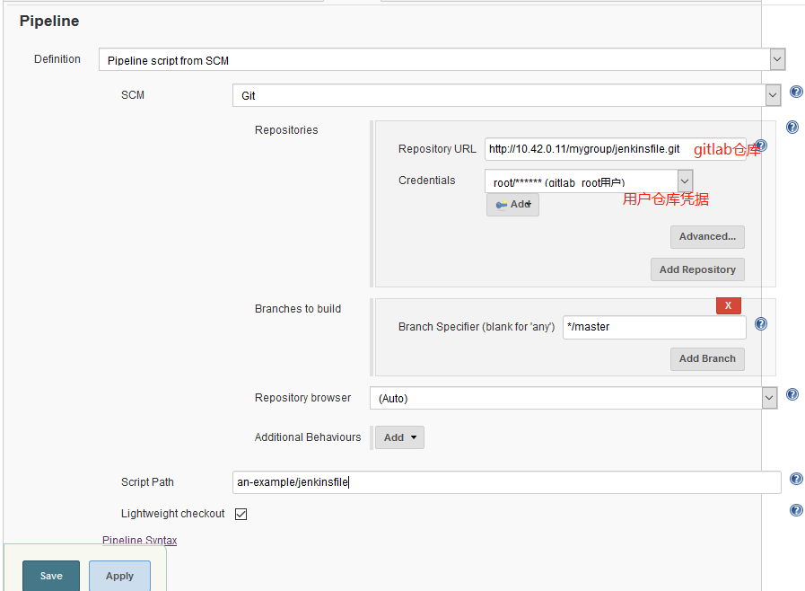
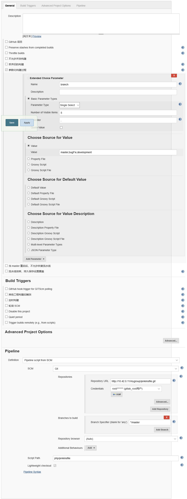

## Defining a Pipeline in the Web UI

- **Click `New Item` on Jenkins home page**



- **In the `Script` text area, enter a Pipeline and click Save.**



```
node ('slave1') {  // allocates an executor and workspace in the Jenkins environment
   echo 'Hello World'  //writes simple string in the Console Output
}
```

## Scripted Pipeline fundamentals

```
node ('slave1') {  
    stage('Build') { 
        // 
    }
    stage('Test') { 
        // 
    }
    stage('Deploy') { 
        // 
    }
}
```

### Pipeline example
```
node ('slave1') {
   stage('Preparation') { 
      echo "preparation..."
   }
   stage('Build') {
     echo "build..."
   }
   stage('Results') {
     echo "results..."
   }
}
```

### Pipeline script from SCM

- **Create a gitlab repository `jenkinsfile` dedicated to storing jenkenfiles**



- **Defining a Pipeline in SCM**




### Pipeline Example for PHP

```
node ('slave1') {
   stage('git checkout') { 
  checkout([$class: 'GitSCM', branches: [[name: '$branch']], doGenerateSubmoduleConfigurations: false, extensions: [], submoduleCfg: [], userRemoteConfigs: [[credentialsId: 'root_gitlab', url: 'http://10.42.0.11/mygroup/myproject.git']]])
   }
   stage('code copy') {
        sh '''rm -rf ${WORKSPACE}/.git
        echo ${WORKSPACE}
        DIR=$(date +"%F_%T")
        mkdir -pv /data/backup/${DIR}
        mv /usr/share/nginx/html/* /data/backup/${DIR}/
        cp -rf ${WORKSPACE}/* /usr/share/nginx/html/'''
   }
   stage('test') {
       sh "curl http://10.42.0.12/index.html"
   }
}

```




### Pipeline Example for JAVA

```
node  {
   //def mvnHome = '/usr/local/maven'
   stage('git checkout') { 
	checkout([$class: 'GitSCM', branches: [[name: '$branch']], doGenerateSubmoduleConfigurations: false, extensions: [], submoduleCfg: [], userRemoteConfigs: [[credentialsId: 'root_gitlab', url: 'http://10.42.0.11/mygroup/solo.git']]])
   }
   stage('maven build') {
        sh '''export JAVA_HOME=/usr
        /usr/local/maven3/bin/mvn clean package -Dmaven.test.skip=true'''
   }
   stage('deploy') {
        sh '''
        JENKINS_NODE_COOKIE=dontkillme
        export JAVA_HOME=/usr
        WAR_NAME=solo.war
        TOMCAT_HOME=/usr/local/tomcat      
        if [ -f $TOMCAT_HOME/webapps/$WAR_NAME ]; then
           mv $TOMCAT_HOME/webapps/$WAR_NAME  /data/backup/$WAR_NAME-$(date +"%F_%T")
           rm -rf $TOMCAT_HOME/webapps/* 
        fi
        
        cp $WORKSPACE/target/$WAR_NAME  $TOMCAT_HOME/webapps/
        PID=$(ps -ef |grep '/usr/local/tomcat'|egrep -v "grep"|awk '{print $2}')
        [ -n "$PID" ] && kill -9 $PID
        /bin/bash $TOMCAT_HOME/bin/startup.sh'''
   }
   stage('test') {
       sh "curl http://test.aliangedu.com/status.html"
   }
}
```

