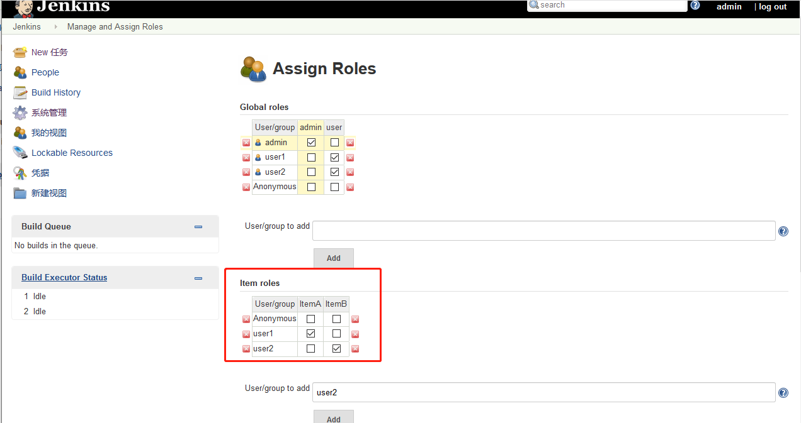

## Allow users to sign up

 

##  Plug-ins need to be installed

- **Role-based Authorization Strategy**

##  Manage and Assign Roles

**Manage Roles**
- Global roles：类似于一个组，我们创建一个user组，此组内用的用户只有 `read` 权限

- Project roles：对项目进行分组赋权

**Assign Roles**
- 将 `user1` 用户，添加到 `user` 组中

- 将项目 `ItemA` 分配给 `user1`,将 `ItemB` 分配给 `user2`

**Note**：基于通配符来对项目进行权限指派，所以需要对项目命名进行规范，标准。